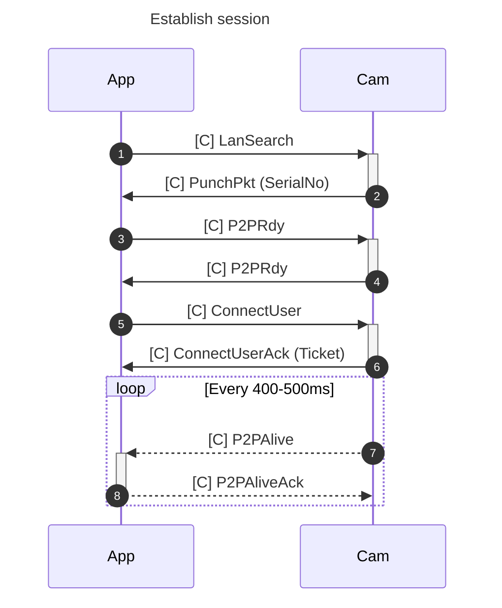
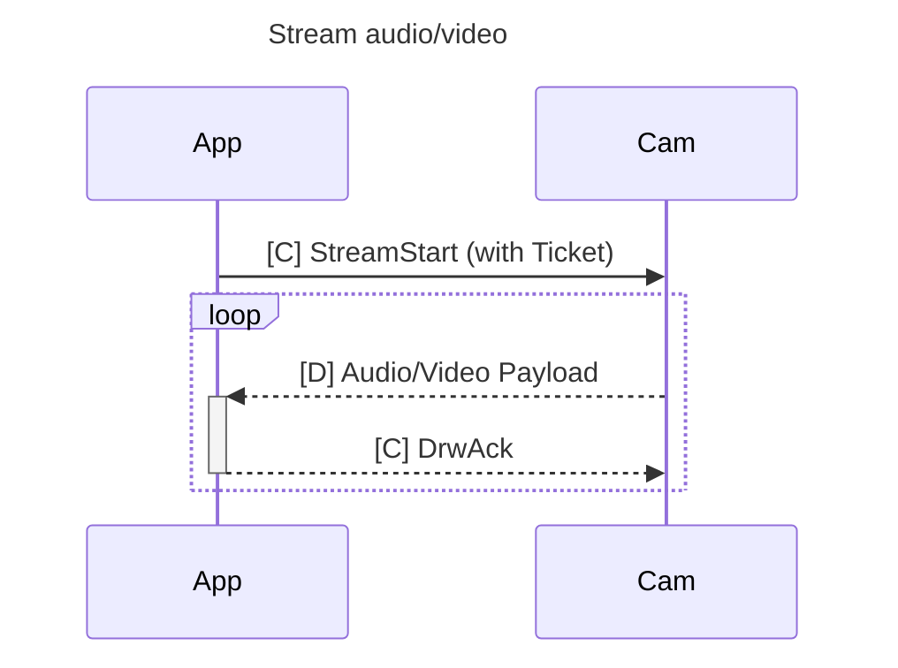

Re-implementation of the "iLnk"/"iLnkP2P"/"PPPP" protocol used on some cheap (\<$5) IP cameras (sometimes branded as 'X5' or 'A9').

* Bought [this X5](https://www.aliexpress.com/item/1005006287788979.html) and [this A9](https://www.aliexpress.com/item/1005006117593880.html).
* App is [YsxLite](https://play.google.com/store/apps/details?id=com.ysxlite.cam&hl=en&gl=US)


Per pictures of the [X5](https://github.com/DavidVentura/cam-reverse/blob/master/pics/pcb.jpg?raw=true), [A9](https://github.com/DavidVentura/cam-reverse/blob/master/pics/pcb_a9.jpg?raw=true) the main chip is TXW817 ([chinese](https://www.taixin-semi.com/Product/ProductDetail?productId=306), [eng, google translate](https://www-taixin--semi-com.translate.goog/Product/ProductDetail?productId=306&_x_tr_sl=auto&_x_tr_tl=en&_x_tr_hl=en&_x_tr_pto=wapp))

## Features

- Multi camera support
- Audio & video streaming
- Rotation / mirroring of video streams
- Friendly names for cameras
- Ability to configure "blank" cameras with Wifi settings

## Building

Run `make build` or `npm run build` to build the server artifact. You can also find some pre-built files [in the CI results](https://github.com/DavidVentura/cam-reverse/actions) or [in the releases](https://github.com/DavidVentura/cam-reverse/releases/)

## Pairing a new camera

Ensure your device in access point mode (the blue LED blinks slowly to indicate that); optionally, press the MODE button for 5s to switch to access point mode.

Connect to the device's access point (e.g., FTYC811847AGFDZ) and run `node dist/bin.cjs pair --ssid <SSID> --password <PASSWORD>`.


## Running

To execute the HTTP server, run `node dist/bin.cjs http_server`; you can access the JPEG stream at http://localhost:5000/.

The roundtrip delay when using MJPEG is [~350ms](pics/delay.jpg?raw=true).

There's a basic UI which can display multiple cameras:


Clicking on the image will take you to a page that has audio streaming. Click the button below the image to mute/unmute the audio.


## Settings

You can provide a config file in `yml` format, check `config.example.yml` for an updated example:

```yml
http_server:
  port: 5000

logging:
  level: debug
  use_color: true

cameras:
  FTYC477360FAWUK:
    alias: "A9"
    rotate: 1
    mirror: false
    fix_packet_loss: yes
    audio: true
  BATC609531EXLVS:
    alias: "X5"

# If you are crossing broadcast domains (VLANs) then
# you need to specify all IPs as unicast targets
discovery_ips:
  - 192.168.40.101
  - 192.168.40.102
  - 192.168.40.103
  - 192.168.40.104
  - 192.168.40.105

# If you are in the same broadcast domain, then
# it's easier to just use the broadcast address of your network
# discovery_ips:
#   - 192.168.1.255

blacklisted_ips:
  - 192.168.40.102
```

All keys are optional

You must restart the HTTP server for changes to the settings file to take effect.

----

## Protocol

The protocol is weirdly complex, though very little communication is necessary to use the device

The base structure of a packet is:


The payload is command-dependent; most commands have only a literal payload, but the `Drw` (`0xf1d0`) command has a framing scheme:

By using the second byte in the payload as a discriminant, we can split the payload into two types of subcommands:

**Control packets**:


The payload on control packets is "encrypted" when the length is > 5.

**Data packets**:


Data packets further discriminate based on the first 4 bytes into: Audio Data (0x55aa15a8), Video data.

### Session

To establish a session, a few _control packets_ are sent.


To start a stream, a single _control packet_ is sent.

The received stream is broken up into 1028 byte payloads, along with a sequence number.

Stitching the payloads together yields JPEG frames for video, and 8KHz A-law PCM for audio.



### Serial

The A9 cameras have a TX/RX test points - connecting with UART at 921600 8N1 gives _read only_ access to some debug logs.

### Discrepancies between cameras

1. Wifi Strength
	- A9 reports '100%' strength
	- X5 reports different strength values

I bricked two cameras by patching out part of the WiFi setup - unclear yet which commands.

After bricking itself, it reports very broken configuration via serial:

```
network interface: ƀ (Default)
MTU: 51050
MAC: 06 18 40 06 3e 51 b4 e2 c6 80 06 3f 77 30 01 00 00 00 00 00 00 00 00 00 00 00 00 00 00 00 74 00 00 00 01 00 00 00 9c ea 01 20 00 00 00 00 00 00 00 00 00 28 60 00 00 00 00 00 00 00 00 00 06 4e 00 20 2a 00 2a 00 80 00 00 00 00 00 ff ff ff ff   ff ff 3e 51 b4 e2 c6 80 08 06 00 01 08 00 06 04 00 01 3e 51 b4 e2 c6 80 01 01 01 01 00 00 00 00 00 00 01 01 01 01 00 28 74 00 00 00 00 00 00 00 00 00 58 4e 00 20 48 00 48 00 80 00 00 00 00 00 ff ff ff ff ff ff 3e 51 b4 e2 c6 80 08 06 45 00 00   48 00 51 00 00 ff 11 c8 be 01 01 01 01 23 9c cc f7 7d 6c
FLAGS: DOWN LINK_DOWN IGMP
ip address: 1.1.1.1
gw address: 1.1.1.1
net mask  : 1.1.1.1

network i
nterface: ^@^@
MTU: 0
MAC: 
FLAGS: DOWN LINK_DOWN  
ip address: 127.0.0.1
gw address: 127.0.0.1
net mask  : 255.0.0.0   
```

## Spyware

When connecting the camera to a network, it tries to send a HELLO (?) to 4 IP addresses:
```
139.155.68.77 - Shenzhen Tencent Computer Systems Company Limited 
119.45.114.92 - Shenzhen Tencent Computer Systems Company Limited
162.62.63.154 - Tencent Building, Kejizhongyi Avenue
3.132.215.40 - ec2-3-132-215-40.us-east-2.compute.amazonaws.com
```

With the payload
```
0000   f1 10 00 28 42 41 54 43 00 00 00 00 00 09 4d 2c   ...(BATC......M,
0010   48 56 44 43 53 00 00 00 08 00 02 01 00 00 6c 7d   HVDCS.........l}
0020   65 28 a8 c0 00 00 00 00 00 00 00 00               e(..........
```

which is `DevLogin`


These addresses are decoded (script at `scripts/dec_svr.py`) from the string `SWPNPDPFLVAOLNSXPHSQPIEOPAIDENLXHXEHIFLKPGLRHUARSTLQEEEPSUIHPDLSPEAOICLOSQEMLPPALNIBIAERHZLKHXEJHYHUEIEHELEEEKEG`.

Every 8-10s

There are some other strings in the APK ending in `-$$` which decode to other ips/hostnames.

Most of the IPs point to AWS compute instances, and this connection is probably used to see live streams over the Internet using the app. It's fine (and recommended!) to block outgoing traffic from the cameras, as it won't affect the HTTP server.


## Other stuff

These little cameras have quite some packet loss - I _tried_ to deal with it by splicing around it on the JPEG payloads, but it's probably wrong, I expected artifacts like this:


but most of the time got:


which _moves_ the rest of the image, causing more visual noise.

For now, images on which there was packet loss get skipped. The algorithm to "fix" packet loss can be enabled as an option.


## Reversing

The interesting implementation is in `libvdp.so`, part of the apk bundle.

Protocol reversing was done with a combination of static analysis of the shared object with [Ghidra](https://ghidra-sre.org/) and dynamic analysis with [Frida](https://frida.re/docs/javascript-api/).

The headers reversed with Ghidra are at `types/all.h`. They are almost not used by this minimal implementation though.

The hooks used with frida are at `frida-hooks.js`, but it's mostly a playground - some useful functions got deleted once I understood the protocol.

There's also a partial Wireshark dissector at `dissector.lua`. You can install it with `make install-wireshark-dissector`.

### Take APK from emulator/sacrificial device
```
adb shell pm list packages | grep ysx
adb shell pm path com.ysxlite.cam
adb shell pm path com.ysxlite.cam | while read -r line ; do adb pull $(echo $line | cut -d: -f2-) ;  done
```
### Push to sacrificial device
```
adb install-multiple *apk
```

### Frida install Android

[docs](https://frida.re/docs/android/)

### Start frida server

```
adb shell 'su -c nohup /data/local/tmp/frida-server-16.1.11-android-arm64 &'
```
