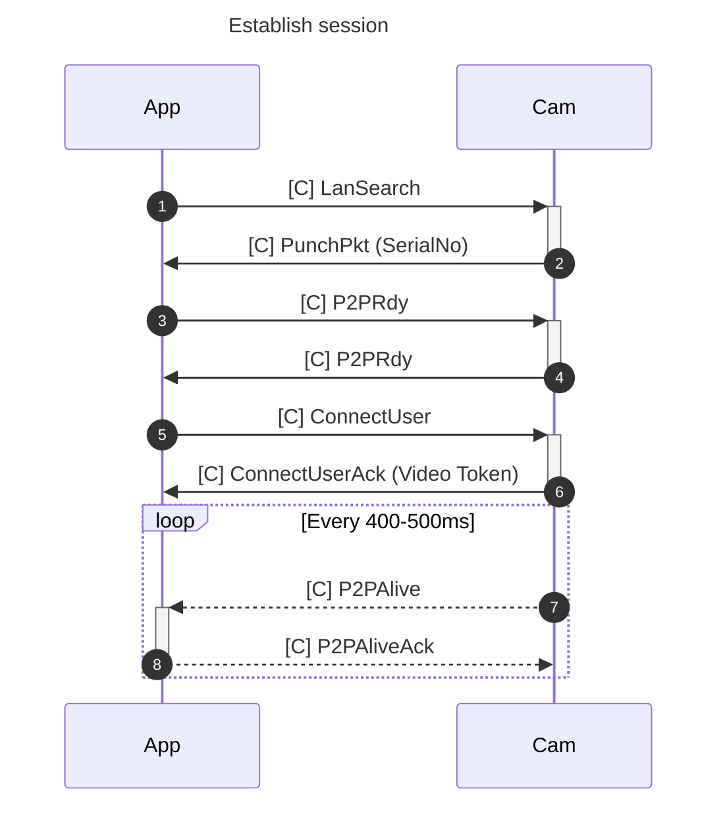
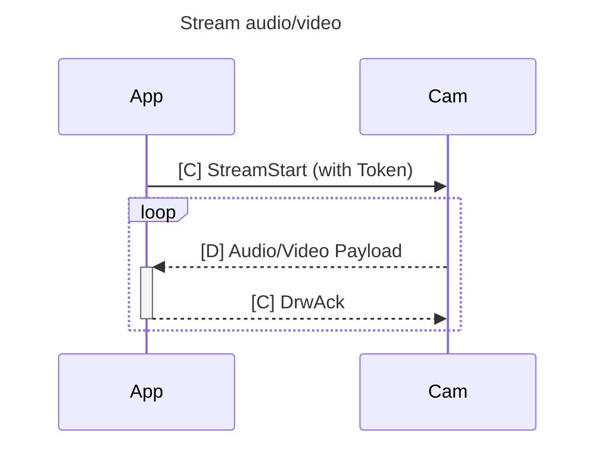

Re-implementation of the "ilnk" protocol used on some cheap chinese cameras (sometimes branded as 'A9').

* Bought [here](https://www.aliexpress.com/item/1005006287788979.html).
  * Waiting for [this A9 camera](https://www.aliexpress.com/item/1005006117593880.html) to validate support.
* App is [YsxLite](https://play.google.com/store/apps/details?id=com.ysxlite.cam&hl=en&gl=US)


Per [pictures](https://github.com/DavidVentura/cam-reverse/blob/master/pics/pcb.jpg?raw=true) the main chip is TXW817 ([chinese](https://www.taixin-semi.com/Product/ProductDetail?productId=306), [eng, google translate](https://www-taixin--semi-com.translate.goog/Product/ProductDetail?productId=306&_x_tr_sl=auto&_x_tr_tl=en&_x_tr_hl=en&_x_tr_pto=wapp))

The interesting implementation is in `libvdp.so`, part of the apk bundle.

Protocol reversing was done with a combination of static analysis of the shared object with [Ghidra](https://ghidra-sre.org/) and dynamic analysis with [Frida](https://frida.re/docs/javascript-api/).

The headers reversed with Ghidra are at `types/all.h`. They are almost not used by this minimal implementation though.

The hooks used with frida are at `frida-hooks.js`, but it's mostly a playground - some useful functions got deleted once I understood the protocol.

There's also a pretty crappy Wireshark dissector at `dissector.lua`. You can install it with `make install-wireshark-dissector`.

## Running
To execute the server, run `make run`; JPEG files will be created in a folder named `captures`.

There's no live-stream server built into this project yet.

## Protocol

The protocol is weirdly complex, though very little communication is necessary to use the device

The base structure of a packet is:


The payload is command-dependent; most commands have only a literal payload, but the `Drw` (`0xf1d0`) command has a framing scheme:

By using the second byte in the payload as a discriminant, we can split the payload into two types of subcommands:

**Control packets**:


The payload on control packets is "encrypted" when the length is > 5.

**Data packets**:


Data packets further discriminate based on the first 4 bytes into: Audio Data (0x55aa15a8), Video data.

### Session

To establish a session, a few _control packets_ are sent.


To start a stream, a single _control packet_ is sent.

The received stream is broken up into 1028 byte payloads, along with a sequence number.

Stitching the payloads together yields JPEG frames for video, and (TBD) for audio.



### Take APK from emulator/sacrificial device
```
adb shell pm list packages | grep ysx
adb shell pm path com.ysxlite.cam
adb shell pm path com.ysxlite.cam | while read -r line ; do adb pull $(echo $line | cut -d: -f2-) ;  done
```
### Push to sacrificial device
```
adb install-multiple *apk
```

### Frida install Android

[docs](https://frida.re/docs/android/)

