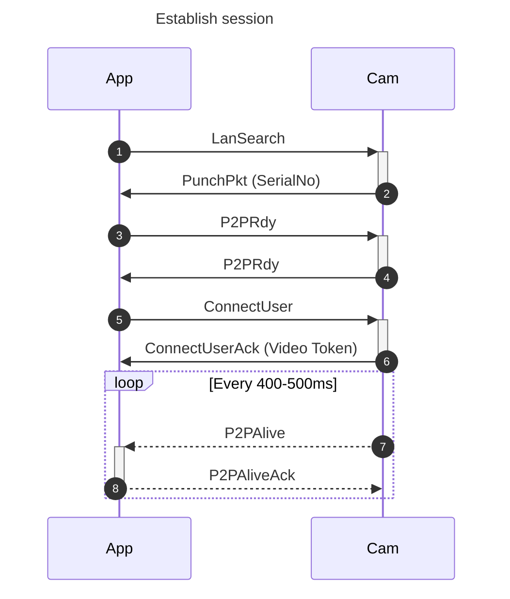
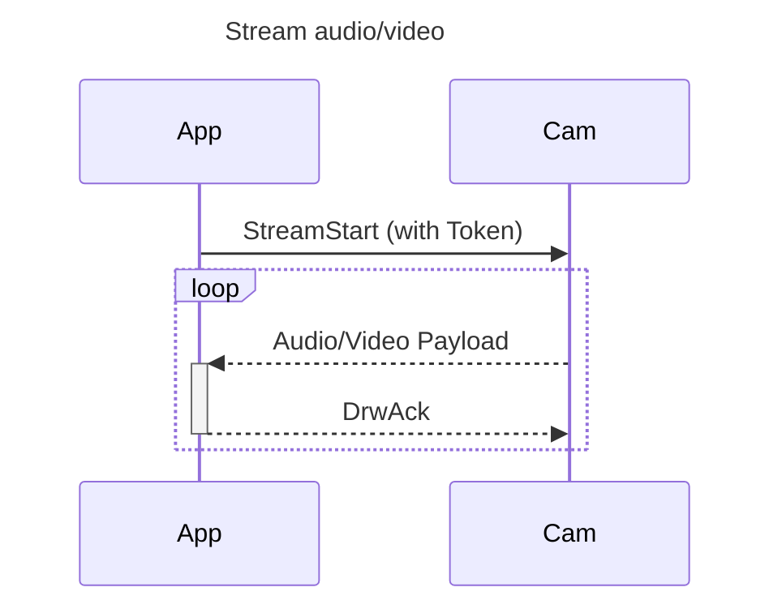

```mermaid
---
title: Establish session
---

sequenceDiagram
	autonumber
    App->>+Cam: LanSearch
    Cam->>-App: PunchPkt (SerialNo)
    App->>+Cam: P2PRdy
    Cam->>-App: P2PRdy
    App->>+Cam: ConnectUser
    Cam->>-App: ConnectUserAck (Video Token)
   
   loop Every 400-500ms
        Cam-->>+App: P2PAlive
        App-->>-Cam: P2PAliveAck
    end
```

```mermaid
---
title: Stream audio/video
---

sequenceDiagram
    App->>Cam: StreamStart (with Token)
   
   loop
        Cam-->>+App: Audio/Video Payload
        App-->>-Cam: DrwAck
    end
```
